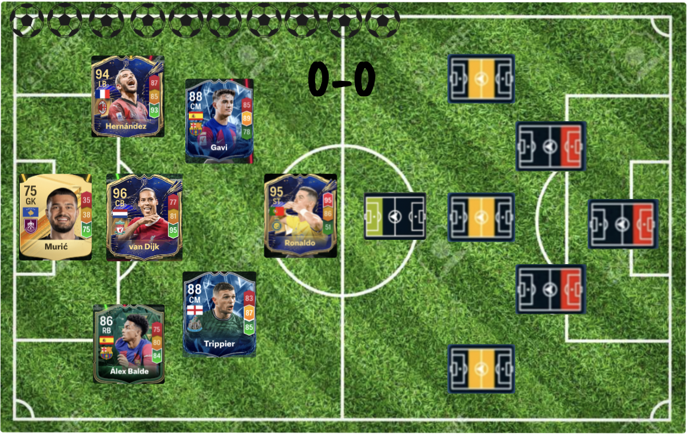
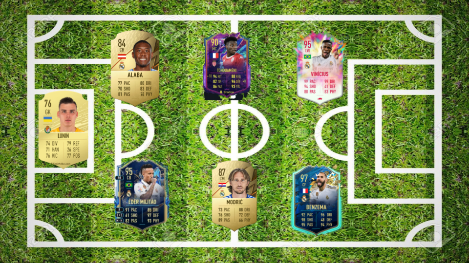
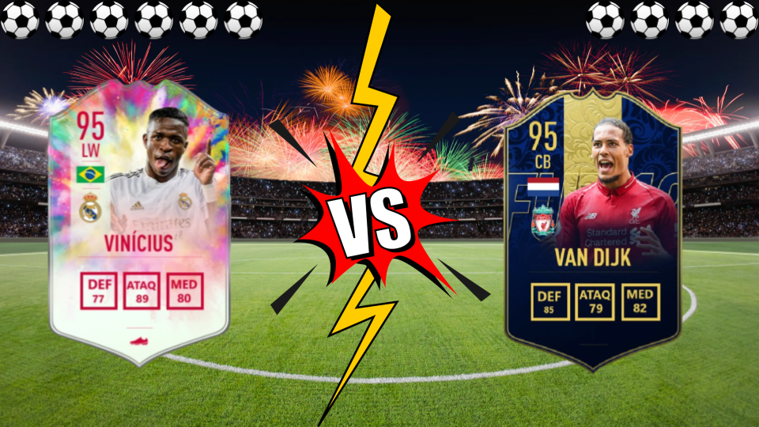
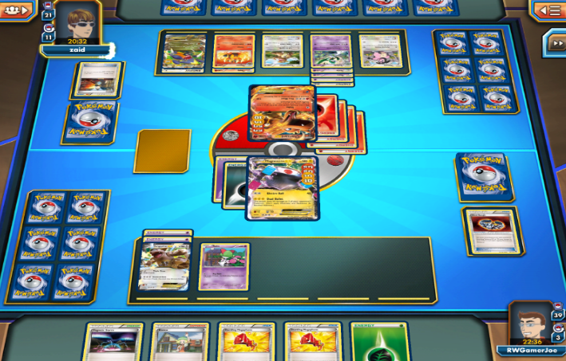
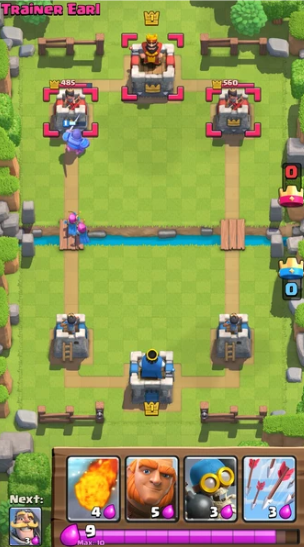
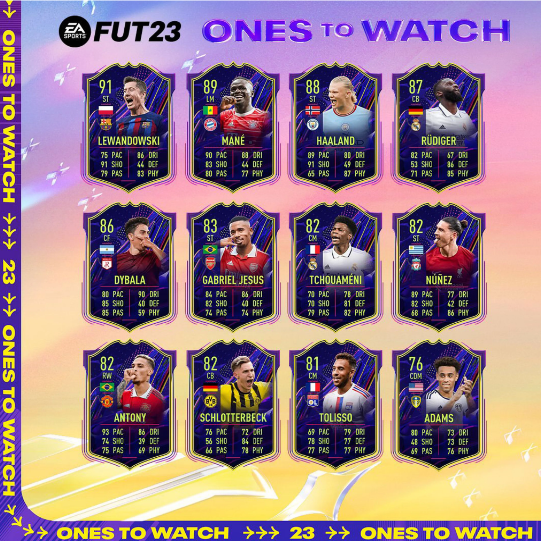

# **Zambombazo**

## _Documento del Diseño del Juego_

---

Diego Ortega Fernández - A01028535

Valeria Tapia González - A01028038

Paul Araque Fernández - A01027626

##
## _Índice_

---

1. [Índice](#índice)
2. [Diseño del Juego](#diseño-del-juego)
    1. [Resumen](#resumen)
    2. [Presentación de la Idea](#presentación-de-la-idea)
    3. [Cómo se Juega](#cómo-se-juega)
    4. [Mentalidad](#mentalidad)
3. [Técnico](#técnico)
    1. [Pantallas](#pantallas)
    2. [Controles](#controles)
    3. [Mecánicas](#mecánicas)
4. [Diseño de Nivel](#diseño-de-nivel)
    1. [Temas](#temas)
    2. [Flujo del Juego](#flujo-del-juego)
5. [Desarrollo](#desarrollo)
6. [Gráficas](#gráficas)
    1. [Atributos de Estilo](#atributos-de-estilo)
    2. [Gráficas Necesarias](#gráficas-necesarias)
    3. [Bocetos](#bocetos)
    4. [Referencias](#referencias)
7. [Sonidos/Música](#sonidosmúsica)
    1. [Atributos de Estilo](#atributos-de-estilo-1)
    2. [Sonidos Necesarios](#sonidos-necesarios)
    3. [Música Necesaria](#música-necesaria)
8. [Planeación](#planeación)

## _Diseño del Juego_

---

### **Resumen**

Te adentrarás en un juego estratégico de cartas basado en el deporte fútbol, poniendo en práctica diferentes estrategias para anotar gol y ganar a tu contrincante, de la mano de tus jugadores favoritos.

### **Presentación de la Idea**

En este juego de fútbol, cada jugador cuenta con 7 cartas previamente seleccionadas por él/ella. Cada carta tiene un valor de defensa, otro de mediocampo y otro de ataque. El primer turno siempre será aleatorio, lo que implica que un jugador elegirá su primera carta, junto a valor de defensa, ataque o mediocampo, y luego el segundo jugador, teniendo en cuenta el valor que eligió el contrincante, deberá elegir una de sus cartas para tratar de ganar el combate. Si el primer jugador eligió el valor de defensa, el segundo jugador deberá elegir el valor de ataque para tratar de anotar un gol, y si el primero eligió mediocampo, el segundo jugador deberá contestar con un valor de mediocampo. Adicionalmente, cada jugador empezará con 10 de energía y cada carta tendrá un coste de entre 1 a 8 de energía para utilizarla. Después de cada combate, se le sumará dos energías a cada jugador y podrán elegir las nuevas cartas a utilizar. Al cada jugador tener 7 cartas, el primero que anote 4 goles ganará la partida y solo existirá el empate en caso de que el marcador esté empatado y los valores totales de las últimas dos cartas es el mismo, aunque es un caso muy extraño de que ocurra. 
Por cada partida, los jugadores recibirán una cantidad de monedas que va a variar dependiendo si ganaron, perdieron o empataron el partido. Con estas monedas, los jugadores podrán comprar sobres en una tienda para tratar de obtener mejores jugadores y así mejorar sus respectivos equipos. 

Extra: Al principio de cada partida, cada jugador podrá seleccionar 1 de 10 cartas aleatorias que podrán utilizar en cualquier turno. Un ejemplo de esta carta puede ser el doble de energía, la cual se podría utilizar a partir de la segunda ronda y le multiplicará la energía por dos al jugador. Otra carta puede ser “robo de carta”, la cual se activaría cuando el otro jugador use su carta aleatoria y su contrincante le robe la carta para su uso. 

### **Cómo se Juega**

El juego empieza al darle al participante 10 en nivel de energía y un sobre con 15 cartas aleatorias, este tiene que escoger solo 7 para la partida. Cada carta representa a un jugador profesional de fútbol que posee 3 habilidades: defensa, ataque y medio campo, y un nivel de energía del 1 al 8 (siendo 8 lo máximo). En el sobre inicial, 5 cartas serían de defensa, 5 medios, 3 delanteros y 2 porteros. 

Con base en su desempeño en la vida real, el jugador tendrá un puntaje acorde a las áreas. Por ejemplo, Cristiano Ronaldo, en ataque tendría 94 pts, en defensa 56 pts, en medio campo 73 pts, y su nivel de energía sería un 8, mientras que alguien como Álvaro Morata tendría 83 pts en ataque, en defensa 49 pts, en medio campo 67 pts y en nivel de energía 6.  
Si es el turno del participante, éste podrá elegir su carta y con qué habilidad va a competir, es decir defensa, ataque o medio campo. Si no es su turno, el participante solo podrá elegir al jugador, mientras que la habilidad con la que competirá, será dependiendo de lo que haya escogido el otro participante. Hay 3 posibles combinaciones:

Si el participante con el turno escoge jugar con defensa, el otro participante tendrá que jugar con ataque.
Si el participante con el turno escoge ataque, el otro tendrá que jugar con defensa.
Si el participante con el turno escoge medio campo, su contrario tendrá que jugar con mediocampo de igual manera.

El participante cuya carta en la habilidad que le corresponda tenga una mayor puntuación, meterá el gol. En caso de tener un empate, se le acreditará un gol a ambos participantes. 
Cada que alguien meta gol, el nivel de energía del participante, bajará de acuerdo al nivel de energía que posea el jugador que haya usado en su ronda. Al pasar a la siguiente ronda, a los dos participantes se les abonarán 2 puntos de energía. 
 
La partida termina cuando un jugador mete 4 goles, o algún jugador se queda sin energía. El participante ganador será acreedor de 1000 monedas que podrá usar en el futuro para comprar sobres más fuertes. 

Para ejemplificar las instrucciones, analizaremos el caso de Cristiano Ronaldo vs Alvaro Morata en la primera ronda, los dos participantes con nivel 10 de energía. 
En este caso, el participante A tendría el turno, escogiendo a Cristiano Ronaldo con su ofensa(94 pts), mientras que el participante B tendría que escoger un jugador para combatir con su defensa, en este caso Alvaro Morata (49 pts). Cristiano metería gol y ganaría la ronda al ser su puntaje mayor que el de su contrincante, pero el jugador A terminaría la ronda con 2 de energía (10 de energía inicial -8 de energía usada en Cristiano=2), mientras que el jugador B tendría 4 de energía porque Morata solo costó 6 de energía. 
Como los dos participantes siguen con vida, para la ronda 2, a ambos se les abonará 2 niveles de energía, por lo que participante A tendría 4 y participante B tendría 8. 

Los participantes deberán buscar una buena táctica para usar su energía de manera adecuada, y cuidar sus cartas con mayor puntaje con base en lo que ha estado haciendo su contrincante. 

Es importante destacar, que cuando se une un usuario al juego, la primera vez que juega le saldrá un sobre con jugadores que tengan una media de nivel de energía del 1 al 4, entre más partidas gane, podrá ir comprando sobres con una media de nivel de energía superior para tener un equipo más fuerte y de igual manera competir contra rivales más fuertes.

### **Mentalidad**

Buscamos que el jugador cree su propia estrategia, pero siempre debe tener en cuenta que necesita marcar al menos 6 goles para ganar el partido. De esta manera, pueden desarrollar su estrategia para empezar el juego más tranquilo y tratando de utilizar sus cartas débiles contra las fuertes del contrincante, pero al final se tendría que apurar para utilizar sus mejores cartas, teniendo el resultado en su contra, para tratar de darle vuelta al marcador. De igual manera, queremos que se sientan un poco nerviosos, ya que si utilizó a su mejor carta, pero el contrincante le ganó de alguna manera, deberá pensar que jugará en el siguiente turno para tratar de ganar ese combate. Asimismo, los nervios les pueden llegar si es un partido importante y el jugador puede estar pensando si jugar más agresivo, calmado o seguir su propia estrategia que le ha funcionado. Finalmente, si el jugador ve que su estrategia no está funcionando, queremos que experimenten probando nuevas ideas y analizando cuál es el mejor momento para jugar cada una de sus cartas. 

## _Técnico_

---

### **Pantallas**

1. Pantalla de Título:
    1. Inicio: Botón para iniciar el juego.
    2. Opciones: Configuración del juego y sonidos. Algunos ejemplos son ajustes de audio, o un tutorial para ver cómo son los botones del juego.
    3. Créditos: Información sobre los créditos del juego.
2. Progreso:
    1. Muestra el avance del jugador en el juego, a medida de que avance y gana puntos.
    2. Historial: Muestra un breve historial de las partidas jugadas, junto a sus resultados.
3. Pantalla de Juego:
    1. Partida: Botón para iniciar una partida.
    2. Inventario: Botón para observar todas las cartas de tu inventario.
    3. Tienda: Botón para entrar a la tienda y comprar sobres
4. Pantalla Partida en Curso:
    1. Enfrentamiento: acá se visualizan las cartas seleccionas que van a combatir.
    2. Cantidad de energía: indica la cantidad de energía que tiene el jugador.
    3. Selección de cartas: se podrá observar la formación del jugador para que seleccione la carta para el siguiente enfrentamiento.
5. Pantalla Partida Finalizada:
    1. Muestra el resultado del partido.
    2. Muestra las recompensas obtenidas por la partida.
    3. Botón para continuar a la pantalla de inicio.

Pantalla Partida en Curso:

### **Controles**

Principalmente, el usuario interactuará con una interfaz gráfica que le servirá para observar su colección de cartas y poder elegir la formación y jugadores que disputarán su partido. De igual manera, dentro de la partida, deberán seleccionar a sus jugadores para el combate, al igual que la estadística a utilizar por medio de clics en la pantalla. Por esta razón, y debido a que la mecánica del juego es sencilla, no existirá una gran variedas de controles para que cada jugador personalice sus controles, sino que sólo podrán utilizar los predeterminados. 

Algunos eventos dentro del juego que podrán ocurrir son:
- Selección de Cartas y Navegación: a través de simples clics, los usuarios podrán seleccionar sus cartas para el enfrentamiento, al igual que navegar por su inventario para ver sus cartas. Esto es clave para la interacción del juego, permitiendo a los jugadores elegir su estrategia y formación de cartas de manera efectiva.
- Gestión de Energía: como cada carta cuesta energía entre 1 y 8, y cada jugador empezará con 10 de energía y se le regenerará 2 por cada turno, los usuarios deberán gestionar su cantidad de energía para cada enfrentamiento, eligiendo cuando utilizar una carta que cuesta mucha energía y cuando no. Esto se logrará a través de la interfaz gráfica, ya que el usuario podrá observar cuánta energía cuesta cada carta, al igual que su energía actual dentro de la partida.
- Compra de Sobres: esta se realizará a través de una interfaz simple de tienda, donde los jugadores podrán observar distintas opciones de sobres y podrán utilizar sus monedas ganadas en los partidos para adquirirlos. Seleccionar y confirmar los sobres se realizará de forma sencilla utilizando controles y botones intuitivos. 

Estos eventos se desencadenarán, gracias a la interfaz del juego, al presionar botones y cartas, las cuáles serán bastantes intuitivas para que los jugadores puedan aprender rápidamente. 

### **Mecánicas**

- Creación de formación: antes de cada partida, el jugador tendrá una pantalla con una formación predeterminada, pero sin ninguna carta. En esta, el usuario podrá elegir si desea cambiar de formación y, posteriormente, elegir que jugadores de su inventario desea utilizar en cada una de las posiciones. Es importante recalcar que si el usuario elije una formación con dos defensas centrales, por ejemplo, no podrá seleccionar a delanteros en esas posiciones, sino que tendrá que poner únicamente a los defensas centrales que tenga en su inventario. Lo mismo con el resto de las posiciones. 
- Enfrentamiento de Cartas: esta es la mecánica principal del juego, la cuaql involucra enfrentamientos directos entre las cartas. Para ello, se necesitará un algoritmo de comparación de valores, en donde se enfrentaría la estadística de ataque de un jugador contra la estadística de defensa de la otra carta en combate y vicerversa. En caso de que se seleccione la estadística de mediocampo, esta se enfrentará contra la estadística de mediocampo del otro jugador. Para lograr esto, se necesitará una lógica de programación para controlar estas comparaciones de manera eficiente y determinar quién es el ganador de cada combate.
- Gestión de Energía: debido a que cada jugador tendrá cierta energía por turno limitado y se le regenerará dos puntos en cada turno, esto puede influenciar en la estrategia de cada uno para ver qué jugador utilizar y cuando. Esto se realizará a través de variables para rastrear la energía disponible de cada juagdor, al igual que cálculos para reducir la cantidad de energía al utilizar una carta.
- Sistema de Recompensa: después de cada partida, los jugadores recibirán una cantidad de monedas de pendiendo del resultado. Con estas monedas, pueden comprar sobres para mejorar sus inventarios. Para implementar esta mecánica, se necesitará gestionar una base de datos para saber cuántas monedas tiene cada jugador. También, se necesitará un sistema aleatorio de cartas que puedes obtener en cada sobre, utilizando un algoritmo de porcentajes dependiendo de que tan buena es la carta.

A continuación se observará un ejemplo de un juego: 
- Primer turno: el jugador 1 selecciona la estadística de ataque de Vinicius Jr, quien tiene 88 y cuesta 6 de energía. El oponente, jugador 2, selecciona la estadística de defensa de Sergio Ramos, quien tiene 84 y cuesta 3 de energía. El combate lo ganó Vinicius, por lo que el jugador obtienen un gol.
- Segundo turno: el jugador 2 tiene 9 de energía, ya que gastó 3 en el turno pasado y se le regeneraron 2 en este nuevo turno. Es por ello que utiliza a la estadística de ataque de Joselu Mato, quien tiene 81 y cuesta 1 de energía, ya que busca utilizar una de sus peores cartas y guardarse las mejores para el final. El jugador 1, pensando que el oponente tiene mucha energía, piensa que va a usar a su mejor carta, por lo que decide utilizar a su peor carta de su formación. Por ello, teniendo 6 de energía, después de haber utilizado 6 de de que se le haya regenerado 2, selecciona a Marcos Alonso, quien cuesta 1 de energía y tiene 79 en defensa. El combate lo ganó Joselu, por tener mejor estadística y la partida ahora va 1-1.
(La estrategia del jugador 1 falló, ya que pensó que el oponente iba a utilizar a su mejor carta y por ello seleccionó a una de sus peores, pero lo que pasó fue que el oponente le ganó el combate con una de sus peores cartas).
- Tercer turno: el jugador 1 tiene 7 de energía y decide utilizar nuevamente a una de sus peores cartas, ya que piensa que el oponente jugará una de sus mejores teniendo mucha energía. Por ello selecciona la estadíostica de mediocampo de uno de sus defensa que es Lucas Vázquez, tiene 78 de mediocampo y cuesta 1 de energía. Ahora, el jugador 2, teniendo 10 de energía, selecciona a Jude Bellingham, quien tiene 89 de mediocampo y cuesta 7 de energía. EL combate lo ganó Bellingham y la partida va 1-2 a favor del jugador 2.
(Acá, la estrategia del jugador 1 funcionó, ya que sabía que el otro jugador tenía mucha energía y utilizó a su mejor carta contra una de sus peores).
- Cuarto turno: el jugador 2, teniendo 5 de energía, decide seleccionar a la estadística de mediocampo de Gavi, quien cuesta 3 de energía y tiene 84. El jugador 1, sabiendo que el oponente no tiene mucha energía y él tiene 8 de energía, selecciona a una buen carta que no cuesta tanto, como lo es Pedri, quien cuesta 4 de energía y tiene 85 en mediocampo. EL jugador 1 gana el combate y el partido se empata 2-2.
(El jugador 1 tiene un poco de ventaje porque el partido va empatado y tiene 2 más de energía que el contrario).
El partido continúa de la misma forma, hasta que se acaben los 7 jugadores de cada equipo o hasta que un jugador llegue a 4 goles. Si el jugador llega a 4 goles, puede decidir si seguir la partida para obtener un mejor resultado y mejores recompensas o si terminarla en ese momento. 

## _Diseño de Nivel_

---
### **Temas**

1. Estadio
    1. Ambiente
        1. Felicidad, Angustia, Emoción.
    2. Objetos
        1. _Ambiente_
            1. Luces / Iluminación
            2. Fuegos Artificiales
            3. Pasto cortado / Campo de Fútbol
            4. Porterías
            5. Grada / Espectadores
            6. Árbitro
        3. _Interactivos_
            1. Cartas en juego
            2. Barra de energía

### **Flujo del Juego**

1. EL jugador le da al botón para comenzar una partida.
2. Aparece una formación predetermianda, pero sin ningún jugador.
3. EL usuario puede elegir cambiar de formación y agregar a los jugadores a sus posiciones. 
4. Inicia la partida. Cada jugador tiene 10 de energía y una formación de 7 jugadores seleccionados previamente. 
5. Primer turno. El primer jugador en elegir es seleccionado de forma aleatoria. SUpongamos que es el jugador 1 para este flujo de juego. Jugador 1 selecciona a uno de sus jugadores, junto a una de sus estadísticas.
6. La CPU o jugador 2, selecciona a uno de sus jugadores, junto a la estadística específica que tiene que utilizar, debido al ataque del jugador 1. 
7. El que tenga mejor estadística, gana el combate y marca un gol. En caso de empate, se suman todas las estadísticas para ver quién gana. Si llegan a empatar, ninguno de los jugadores metió gol. 
8. Segundo turno. Se le resta la cantidad de energía utilizada a los jugadores y se les suma 2 por el nuevo turno. La CPU elige a un jugador, junto a una de sus estadísticas y el jugador 1 debe seleccionar a uno de sus jugadores para combatir. 
9. Los turnos continúan con cada jugador seleccionado, dependiendo de la cantidad de energía y estadísticas elegidas.
10. El partido termina cuando se utilicen a los 7 jugadores o cuando un jugador marque 4 goles.
11.En caso de que un jugador marque 4 goles antes de utilizar a los 7 jugadores, tiene la opción de seguir jugando o terminar la partida.
12. Cuando se termina la partida, aparece una pantalla con las recompensas, el resultado final, el nivel de progreso y botón para avanzar.
13. Aparece la pantalla de inicio.

## _Desarrollo_

---

1. clase Carta
 - nombre
 - posición
 - habilidades (defensa, ataque, medio campo)
 - nivel de energía

2. clase Formación
 - tipo de Formación
 - posiciones
		
3. clase Usuario 
 - energía
 - mazo
 - formación
 - monedas
 - resultadosPartidos
 > métodos:
 - escogerCarta
 - escogerAlineación
 - escogerSkill
 - calcularPuntuacion
 - updateEnergia

4. clase GameController
 - jugadores
 - ronda
 - goles
 > métodos:
 - startGame
 - turno
 - determinarGanador
 - endGame
 - entregarMonedas
 - regularEnergía
 - 
5. clase paqueteCartaCompras:
 - nivelPromedioEnergia
 - cartas
 > métodos
 - generarPaquete 
	
6. clase Tienda
 - paquetesDisponibles
 - inventorioUsuario
 > métodos 
 - comprarPaquete
 - verPaquetesDisponibles
 - actualizarInventorio
 - abrirPaquetes
 - mostrarEstadoDeCuenta

## _Gráficas_

---

### **Atributos de Estilo**

What kinds of colors will you be using? Do you have a limited palette to work with? A post-processed HSV map/image? Consistency is key for immersion.

What kind of graphic style are you going for? Cartoony? Pixel-y? Cute? How, specifically? Solid, thick outlines with flat hues? Non-black outlines with limited tints/shades? Emphasize smooth curvatures over sharp angles? Describe a set of general rules depicting your style here.

Well-designed feedback, both good (e.g. leveling up) and bad (e.g. being hit), are great for teaching the player how to play through trial and error, instead of scripting a lengthy tutorial. What kind of visual feedback are you going to use to let the player know they&#39;re interacting with something? That they \*can\* interact with something?

### **Gráficas Necesarias**

1. Equipos / Cartas
    1. Real Madrid
        1. Atacantes (ataque, defensa, medio campo)
        2. Defensores (ataque, defensa, medio campo)
        3. Medio Campo (ataque, defensa, medio campo)
        4. Portero (ataque, defensa, medio campo)
    2. Barcelona
       	1. Atacantes (ataque, defensa, medio campo)
        2. Defensores (ataque, defensa, medio campo)
        3. Medio Campo (ataque, defensa, medio campo)
        4. Portero (ataque, defensa, medio campo)
    4. Atlético de Madrid
       	1. Atacantes (ataque, defensa, medio campo)
        2. Defensores (ataque, defensa, medio campo)
        3. Medio Campo (ataque, defensa, medio campo)
        4. Portero (ataque, defensa, medio campo)
    6. Sevilla
	1. Atacantes (ataque, defensa, medio campo)
        2. Defensores (ataque, defensa, medio campo)
        3. Medio Campo (ataque, defensa, medio campo)
        4. Portero (ataque, defensa, medio campo)
2. Ambiente
    1. Cancha de fútbol
    2. Porterías
    3. Balones
    4. Barra de energía
    5. Árbitro

### **Bocetos**

Menú de inicio:

Pantalla de Selección de Formación y Jugadores:

Pantalla Partida en Curso:

Batalla en juego:

### **Referencias**

Algunos de los videojuegos de cartas que se usaron como referencia e insipiración, fueron los siguientes:

Pokémon:

Clash Royale: 

Fantasy:

## _Sonidos/Música_

---

### **Atributos de Estilo**

### **Sonidos Necesarios**

1. Sonidos Menu
clics suaves y satisfactorios cuando los jugadores navegan por los menús o seleccionan opciones
2. sonidos Notificaciones
sonidos claros y distintos para alertar a los jugadores sobre nuevos mensajes, logros o eventos.

3. sonidos Partido
 - Barajado de cartas: sonidos de crujidos y volteos cuando los jugadores exploran sus colecciones de cartas o seleccionan cartas para un juego.
 - Celebraciones de goles: aplausos y cantos de la afición cuando se marca un gol
 - Uso de cartas: efectos de sonido para acompañar la selección y colocación de cartas durante el juego
 - Cambios en el nivel de energía: señales sonoras para indicar cambios en los niveles de energía o la gestión de recursos
 - Transiciones de turno: señales de audio para señalar el inicio y el final del turno de cada jugador, manteniendo el ritmo y el ritmo durante el juego.
   
4. Sonidos ambientales:

 - Atmósfera de estadio: sonidos de fondo de multitudes vitoreando y silbidos de árbitros para crear un ambiente realista de estadio de fútbol.
 - Reacciones del público: reacciones variadas del público para adaptarse a diferentes situaciones de juego

### **Música Necesaria**
1. canciones optimistas y energéticas:
2. Himnos deportivos y cantos de estadio:

## _Planeación_

---

1. hacer el excel con todas las cartas - semana 5
3. desarrollar clases bases- semana 6
4. crear base de datos -semana 6
5. desarollar clases derivdas- semana 7,8,9
6. desarrollar interfaz unity semana 7,8,9
7. hacer pruebas- semana 9
